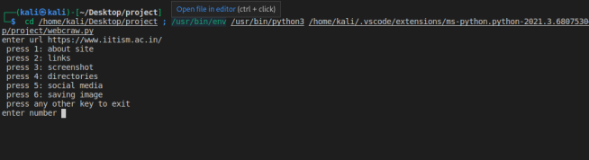

Web Crawler Project

The web crawler project takes the code in html from a site and arranges the data needed. The information required is sorted out and collected.

A class parentdir is defined. It takes input of url and directory if available.
The function callurl downloads html source code of website input.
The function findinglinks finds the links present in source code. It then sorts them into external links, social media links and directories.

Links from the site

The function screenshot takes the screenshot of the provided site using selenium.

The screenshot of the site

The function saveimage saves images from the site in a folder.

An image saved from the site

The function contact finds and prints all the emails and phone numbers.
The function output prints all the values collected by the functions before.
The function finddir downloads the html souce code of the directory asked.
The function dns_info provides the information for dns.
The function giveback returns the directories present.

The main source code starts working and asks user to input of the site url.
A variable of class parentdir is created.
The functions callurl followed by output are called.
The outputs are provided as per user's requests which include description, links, directories, screenshot, images and social media handles.

User is asked to enter depth which is the number of times the crawler would enter directories and further directories.
A for loop is created for range depth.
A variable of class parentdir is created.
The functions finddir followed by giveback are called.
The outputs are provided as per user's request.
The giveback function returnes directories from which one is again chosen by the user to enter.
